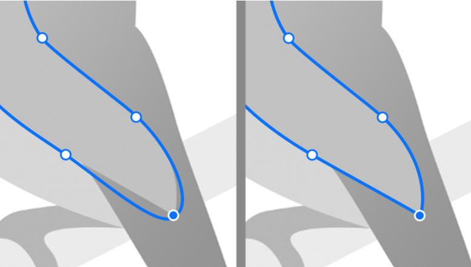

## [BezierCurveVisualization](src/main/java/com/kiu/numericalanalysis/baziercurve/BezierCurveVisualization1.java)
This code has 1 control point an you can change the point by dragging the mouse 
and see how the curve changes

## [BezierCurveVisualization(2 points)](src/main/java/com/kiu/numericalanalysis/baziercurve/BezierCurveVisualization.java)
This coe has 2 control points an you can see it can create more complicated curves

# Edit Photo in Photoshop
### 1. Get Black and White Photo to edit

### 2. Using Bezier Curves get shapes

### 3. Edit shapes 

### 4. Add color to each shape
